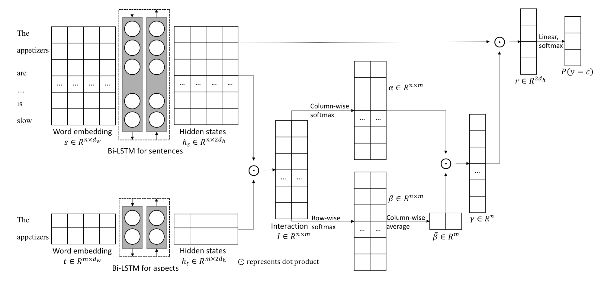
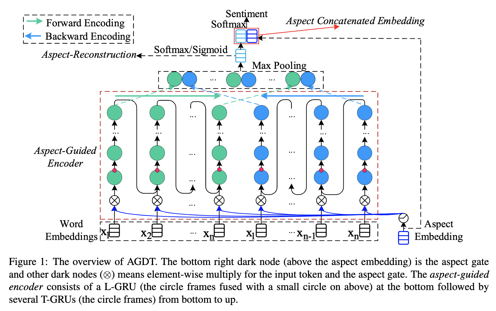

# Fine-grained Sentiment Analysis

## Tasks

- ABSA
  - ASC: Aspect Sentiment Classification
  - E2E-ABSA
  - Complete ABSA
  - ATE: Aspect Term Extraction
  - OTE: Opinion Term Extraction

- Emotion Analysis

| Tasks            | Input            | Output                                      |
| ---------------- | :--------------- | ------------------------------------------- |
| ASC              | sentence, aspect | aspect sentiment                            |
| E2E-ABSA         | sentence         | aspect term, aspect sentiment               |
| Complete-ABSA    | sentence         | aspect term, aspect sentiment, opinion term |
| ATE              | sentence         | aspect term                                 |
| OTE              | sentence         | opinion term                                |
| ATE&OTE          | sentence         | aspect term, opinion term                   |
| Emotion Analysis | sentence         | joy, anger, fear, etc.                      |
|                  |                  |                                             |

--------------

## Performance (Accuracy / Macro-F1)

### ASC Models

|           | 14SemEval-REST | 14SemEval-LAPTOP | 14-TWITTER  |
| --------- | :------------: | :--------------: | :---------: |
| TD_LSTM   |       -        |        -         |  70.8/69.0  |
| TC-LSTM   |       -        |        -         |  71.5/69.5  |
| ATAE-LSTM |     77.2/-     |      68.7/-      |      -      |
| MemNet    |  78.16/65.83   |   70.33/64.09    | 68.50/66.91 |
| IAN       |     78.6/-     |      72.1/-      |      -      |
| RAM       |  80.23/70.80   |   74.49/71.35    | 69.36/67.30 |
| MGAN      |  81.25/71.94   |   75.39/72.47    | 72.54/70.81 |

------

## Paper list

### ASC

- **[COLING-2016]** Effective LSTMs for Target-Dependent Sentiment Classification [[paper]](https://www.aclweb.org/anthology/C16-1311/)

  
  

--------

- **[ACL-2017]** Recurrent Attention Network on Memory for Aspect Sentiment Analysis [[paper]](https://www.aclweb.org/anthology/D17-1047/)

  

--------

- **[IJCAI-2017]** Interactive Attention Networks for Aspect-Level Sentiment Classification [[paper]](https://arxiv.org/abs/1709.00893)

  

--------

- **[IJCAI-2017]** Aspect Level Sentiment Classification with Attention-over-Attention Neural Networks [[paper]](https://arxiv.org/abs/1804.06536)

  

--------------

- **[ACL-2018]** Aspect Based Sentiment Analysis with Gated Convolutional Networks [[paper]](https://www.aclweb.org/anthology/P18-1234/)

<table>
    <tr>
        <td >

        
</td>
        <td >

        
</td>
    </tr>
</table>

-----------------

- **[EMNLP-2018]** Multi-grained Attention Network for Aspect-Level Sentiment Classification [[paper]](https://www.aclweb.org/anthology/D18-1380/)

  

------------

- **[ACL-2018]** Transformation Networks for Target-Oriented Sentiment Classification [[paper]](https://www.aclweb.org/anthology/P18-1087/)

  

---------

- **[EMNLP-2019]** A Novel Aspect-Guided Deep Transition Model for Aspect Based Sentiment Analysis [[paper]](https://arxiv.org/abs/1909.00324) [[code]](https://github.com/XL2248/AGDT)

  

------

### E2E-ABSA

- **[AAAI-2019]** A Unified Model for Opinion Target Extraction and Target Sentiment Prediction [[paper]](https://arxiv.org/abs/1811.05082)

  

----------

- **[EMNLP-2019]** Exploiting BERT for End-to-End Aspect-based Sentiment Analysis [[paper]](https://arxiv.org/abs/1910.00883)

  

-------------

- **[ACL-2019]** DOER: Dual Cross-Shared RNN for Aspect Term-Polarity Co-Extraction [[paper]](https://www.aclweb.org/anthology/P19-1056/)

  

------

### Complete ABSA

- **[AAAI-2020]** Knowing What, How and Why: A Near Complete Solution for Aspect-based Sentiment Analysis [[paper]](https://arxiv.org/abs/1911.01616v2)

  

------

### ATE

- **[IJCAI-2018]** Aspect Term Extraction with History Attention and Selective Transformation [[paper]](https://arxiv.org/abs/1805.00760)

  

---------------

- **[ACL-2018]** Double Embeddings and CNN-based Sequence Labeling for Aspect Extraction [[paper]](https://www.aclweb.org/anthology/P18-2094/)

  

-------------

### OTE

- **[NAACL-2019]** Target-oriented Opinion Words Extraction with Target-fused Neural Sequence Labeling [[paper]](https://www.aclweb.org/anthology/N19-1259/) [[code]](https://github.com/NJUNLP/TOWE)

  

------

### ATE & OTE

- **[AAAI-2017]** Coupled Multi-Layer Attentions for Co-Extraction of Aspect and Opinion Terms [[paper]](http://www.aaai.org/Conferences/AAAI/2017/PreliminaryPapers/15-Wang-W-14441.pdf)

  

-----------

### Emotion Classification

- **[EMNLP-2018]** Improving Multi-label Emotion Classification via Sentiment Classification with Dual Attention Transfer Network [[paper]](https://www.aclweb.org/anthology/D18-1137/)

  

------

## Projects & Competition

- [ABSA-PyTorch](https://github.com/songyouwei/ABSA-PyTorch)
- 2018 CCF-汽车行业用户观点主题及情感识别ASC挑战赛
  - Rank 1 [[code]](https://github.com/yilifzf/BDCI_Car_2018)
  - Rank 7 [[code]](https://github.com/nlpjoe/CCF-BDCI-Automotive-Field-ASC-2018)
- 2018 AI Challenger 全球AI挑战赛 - 细粒度用户评论情感分析
  - Rank 1 [[code]](https://github.com/chenghuige/wenzheng) [[link]](https://tech.meituan.com/2019/01/25/ai-challenger-2018.html)
  - Rank 16 [[code]](https://github.com/xueyouluo/fsauor2018)
  - Rank 17 [[code]](https://github.com/BigHeartC/Al_challenger_2018_sentiment_analysis)

------

## DataSet

**Chinese**

- AI-Challenge [[data](https://drive.google.com/file/d/1OInXRx_OmIJgK3ZdoFZnmqUi0rGfOaQo/view)] 
- SemEval ABSA 2016 [[data](http://alt.qcri.org/semeval2016/task5/index.php?id=data-and-tools)] 

**English**

- Amazon product data [[data](http://jmcauley.ucsd.edu/data/amazon/)]
- Web data: Amazon reviews [[data](https://snap.stanford.edu/data/web-Amazon.html)]
- Amazon Fine Food Reviews [[kaggle](https://www.kaggle.com/snap/amazon-fine-food-reviews)]
- SemEval ABSA

------

## Reference

- [jiangqn/Aspect-Based-Sentiment-Analysis](https://github.com/jiangqn/Aspect-Based-Sentiment-Analysis)
- [YZHANG1270/Aspect-Based-Sentiment-Analysis](https://github.com/YZHANG1270/Aspect-Based-Sentiment-Analysis)
- [Data-Competition-TopSolution](https://github.com/Smilexuhc/Data-Competition-TopSolution)